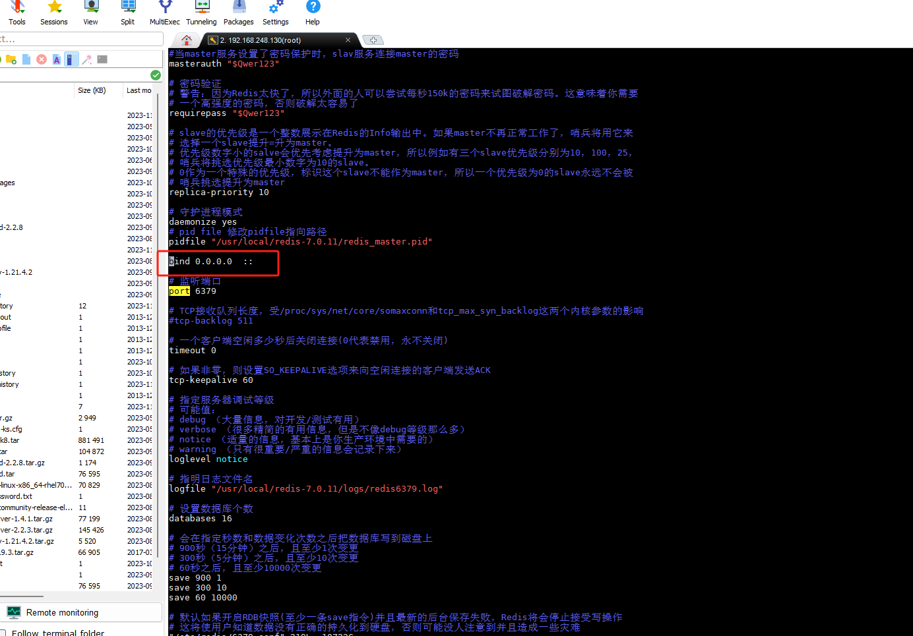
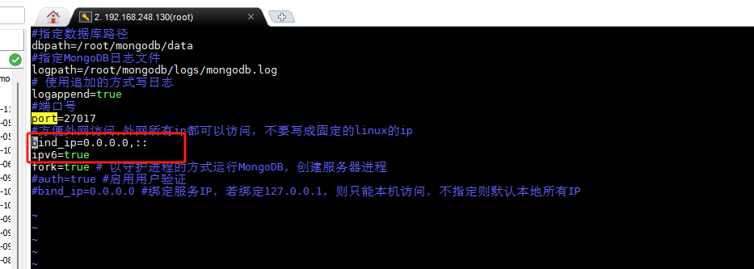

# IPV6中间件配置文件

-----

## redis

修改点：
    修改配置文件(xx.conf)



----

## mongo

    修改配置文件（mongodb.conf）



-----

## nacos
    nacos版本大于1.4.0,执行脚本（1.4.0-ipv6_support-update.sql）

````

ALTER TABLE `config_info_tag`
MODIFY COLUMN `src_ip` varchar(50) CHARACTER SET utf8 COLLATE utf8_bin NULL DEFAULT NULL COMMENT 'source ip' AFTER `src_user`;

ALTER TABLE `his_config_info`
MODIFY COLUMN `src_ip` varchar(50) CHARACTER SET utf8 COLLATE utf8_bin NULL DEFAULT NULL AFTER `src_user`;

ALTER TABLE `config_info`
MODIFY COLUMN `src_ip` varchar(50) CHARACTER SET utf8 COLLATE utf8_bin NULL DEFAULT NULL COMMENT 'source ip' AFTER `src_user`;

ALTER TABLE `config_info_beta`
MODIFY COLUMN `src_ip` varchar(50) CHARACTER SET utf8 COLLATE utf8_bin NULL DEFAULT NULL COMMENT 'source ip' AFTER `src_user`;

````

-----

## mysql
    不用修改

-----

## 工程分支
    ipv6分支，变更文件为*-ipv6.yml文件

